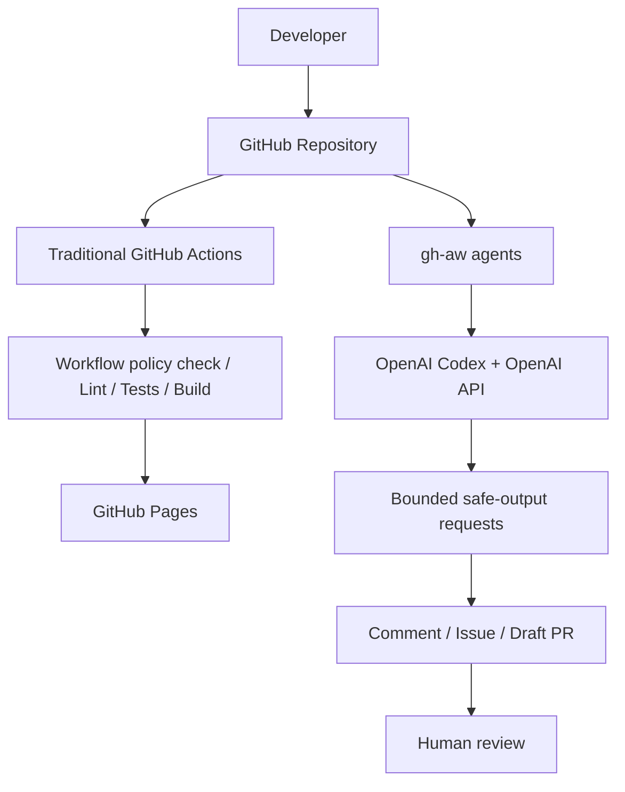

# To-Do App CI/CD with gh-aw Agents

This repository demonstrates how traditional GitHub Actions CI/CD and GitHub Agentic Workflows work together.

GitHub Actions handles deterministic lint, test, build and deployment operations.
GitHub Agentic Workflows use **OpenAI Codex with an OpenAI API key** for reasoning-oriented
software engineering tasks.

**Runtime engine: `codex` · Inference model: `openai/gpt-5.4-mini` · Reasoning: `low`**

For today’s small-budget trial, follow [the $5 demo guide](docs/BUDGET-DEMO.md).

The original Copilot configuration has been replaced. The tool used to generate this
repository is independent of its runtime engine. All eight agent sources now explicitly
select Codex and OpenAI inference. A Copilot license is not required. ChatGPT subscription
login is not used by this integration; API access and billing are configured on OpenAI Platform.

## Start locally

Use Node.js 24 LTS:

```sh
npm ci
npm run dev
```

Open the Vite URL ending in `/github-agentic-sdlc-demo/`. The application itself needs no
API key or backend. It supports create/edit/delete, completion, All/Active/Completed
filters, remaining count, clearing completed tasks and localStorage persistence.
Enter saves an edit; Escape cancels it. Blank titles are rejected and titles render as
text. Browser data is not encrypted, synced across devices or synchronized between tabs.
Unreadable stored data is preserved and storage failures are reported in the UI.

```sh
npm run workflows:check
npm run lint
npm test
npm run build
npm run preview
```

## Two kinds of automation



CI answers **“Did these predefined checks pass?”** Codex investigates meaning and proposes
changes. A green build is not proof of semantic correctness. Deployment remains entirely
deterministic and checks its own build before publishing.

| Workflow | Type | Runtime | Trigger | Purpose |
|---|---|---|---|---|
| CI | GitHub Actions | None | PR, main push, manual | Workflow policy, lint, tests, build |
| Deploy | GitHub Actions | None | main push, manual on main | Checked artifact → Pages |
| AI · PR Reviewer | gh-aw | Codex / OpenAI API | PR opened/reopened/synchronize | Defects and test gaps |
| AI · Security Review | gh-aw | Codex / OpenAI API | PR / manual | Evidence-backed security review |
| AI · Issue Triage | gh-aw | Codex / OpenAI API | Issue opened | Labels, priority, questions |
| AI · Issue Fixer | gh-aw | Codex / OpenAI API | Maintainer applies ai-fix | Issue → tested draft PR |
| AI · Implement Task | gh-aw | Codex / OpenAI API | Manual task input | Requirement → tested draft PR |
| AI · CI Investigator | gh-aw | Codex / OpenAI API | CI failure/timeout on configured branches | Diagnosis issue |
| AI · Release Readiness | gh-aw | Codex / OpenAI API | Manual | Advisory readiness issue |
| AI · Documentation Updater | gh-aw | Codex / OpenAI API | Manual | README correction draft PR |

## GitHub setup

Follow [ORG-SETUP.md](docs/ORG-SETUP.md) for the complete other-machine and organization
repository setup, including transferring all local branches and configuring secrets.

1. Put the updated sources **and generated `.lock.yml` files** on the target repository's main.
2. Add an OpenAI Platform API key as the target repository's Actions secret **`OPENAI_API_KEY`**.
3. Permit the pinned official actions and `github/gh-aw-actions`. Enable **Allow GitHub Actions
   to create and approve pull requests** for PR creation; these agents never approve or merge.
4. Run `npm run labels:setup` from a clone whose origin points to the intended repository.
5. For deployment, choose **Settings → Pages → Source → GitHub Actions** and allow main in
   the `github-pages` environment. Pages availability depends on your organization plan/policy.
6. Start **AI · Security Review** manually on main as a first inference smoke test.

All sources use the same explicit engine/model selection:

```yaml
engine:
  id: codex
  args: ["-c", 'model_reasoning_effort="low"']
  harness:
    max-retries: 0
model: openai/gpt-5.4-mini
permissions:
  contents: read
```

The real compiler injects `${{ secrets.CODEX_API_KEY || secrets.OPENAI_API_KEY }}` into
Codex authentication. Configure **only OPENAI_API_KEY** for this setup. If an organization
already exposes CODEX_API_KEY, it takes precedence; have its owner remove that repository's
access to the conflicting secret or deliberately use that key. Never store a key in source,
`.env` committed to Git, a `VITE_*` variable, workflow inputs, prompts or PR descriptions.
Setting a key on your laptop does not configure GitHub Actions. See
[gh-aw Codex authentication](https://github.github.com/gh-aw/engines/codex/) and
[OpenAI API setup](https://developers.openai.com/api/docs/quickstart).

The app is unchanged by this engine migration. The API key is used by the GitHub-hosted
workflow runner, not the browser. Repository context supplied to the model is sent to
OpenAI; use an organization-approved API project and data policy.

## CI for agent-created PRs

The default GitHub Actions token normally suppresses follow-on workflow events. Optionally
add **GH_AW_CI_TRIGGER_TOKEN**, a fine-grained GitHub PAT scoped only to this repository with
**Contents: Read and write**. gh-aw uses it in the mutation job to add an empty commit and
trigger PR CI. This credential is separate from the OpenAI API key.

Without it, draft PR creation still works. After inspecting the generated branch, a human
can run:

```sh
gh workflow run ci.yml --ref AGENT_PR_BRANCH
```

Check the branch and SHA on that run. Required-check association must be verified before
merge; a human-authenticated empty commit on the PR branch triggers normal PR CI too.
See [official CI-trigger behavior](https://github.github.com/gh-aw/reference/triggering-ci/).

## Editing and validating workflows

Markdown is the authoring format. Actions executes the generated YAML. After editing a
source, compile and commit both files. Do not hand-edit `.lock.yml` files.
The checked-in locks use **gh-aw v0.89.21**, Codex CLI **0.154.0**, and the explicit model
above. Model access, rate limits, credits and organizational policy need a real runtime check.

```sh
gh aw version
gh aw compile
npm run workflows:check
gh aw validate
gh aw validate --strict
gh aw doctor
gh aw run ai-security-review --ref main
gh aw run ai-release-readiness --ref main
gh aw run ai-docs-updater --ref main
gh aw logs ai-security-review -c 1 --artifacts all
gh aw status
```

The policy check verifies all eight engines, prompt hashes, agent permissions, generated
secret wiring, disabled shells for readers, safe-output limits and protected-file boundaries.
It runs in normal CI and deployment builds without an API key or gh-aw installation.
Use the gh-aw compiler to verify all source/lock details after edits; the policy check is
not a replacement for compilation. An intentional credential migration can produce a safe
update warning until the reviewed new locks are committed; see the audit report.

GitHub Pages uses the target repository's configured base path from `configure-pages`, so
renaming the repository does not require a hardcoded source change. Locally the original
base path remains the default. For a local target-path check:

```sh
PAGES_BASE_PATH=/your-org-repo-name/ npm run build
```

The conventional workflows and PR bases assume **main**. Follow the setup guide if the
organization uses a different default branch. This is prepared for GitHub.com; GitHub
Enterprise Server compatibility is not asserted by the local checks.

## Demo and audit documents

- [DEMO.md](DEMO.md): customer sequence, exact task input and branch/PR commands.
- [DEMO-ISSUES.md](DEMO-ISSUES.md): copy-ready issue bodies.
- [Organization setup](docs/ORG-SETUP.md): move to another machine and use your API key.
- [Workflow reference](docs/WORKFLOWS.md): triggers, tools, reads and outputs for every agent.
- [Security model](docs/SECURITY-MODEL.md): credential boundaries and protected files.
- [Workflow audit](docs/WORKFLOW-AUDIT.md): findings, corrections and remaining limitations.
- [Validation](docs/VALIDATION.md): actual checks and unverified runtime conditions.

Intentional defects live only on demo branches. Never merge them into main. The isolated
issue-fix fixture allows a real bug-fixing demonstration while main stays correct.
