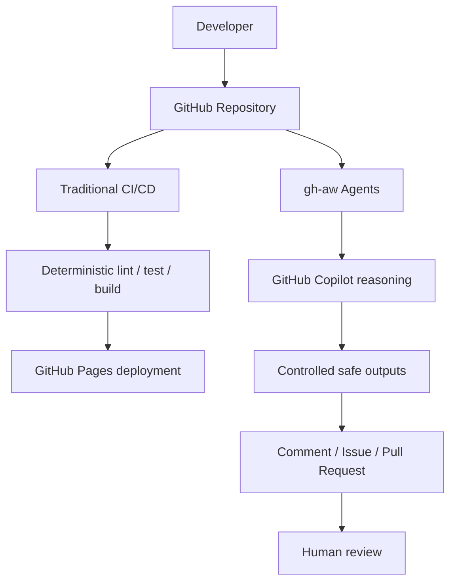

# To-Do App CI/CD with gh-aw Agents

This repository demonstrates how traditional GitHub Actions CI/CD and GitHub Agentic Workflows work together.

GitHub Actions handles deterministic build, test and deployment operations.

GitHub Agentic Workflows use GitHub Copilot to perform reasoning-oriented software engineering tasks.

**Runtime AI Engine: GitHub Copilot**

The application/workflows may have been generated initially using any coding LLM.
That generation-time LLM is unrelated to the runtime AI engine.
All agentic workflows in this repository explicitly use GitHub Copilot (`engine: copilot`).
No third-party LLM API key is needed.

## Start locally

Use Node.js 24 LTS and npm:

```sh
npm ci
npm run dev
```

Open the Vite URL ending in `/github-agentic-sdlc-demo/`. To verify the production build:

```sh
npm run lint
npm test
npm run build
npm run preview
```

Tasklight supports create, edit, delete, complete/incomplete, All/Active/Completed filters,
remaining count, clearing completed tasks and browser-local persistence. Keyboard users
can save edits with Enter and cancel with Escape. Tasks render as text, never HTML.
Empty/whitespace-only titles are rejected. Data stays in localStorage on this browser and
origin; it is not synced between devices or tabs. There is no backend or database.
Unreadable stored data is preserved and changes remain session-only; storage failures
are reported in the UI. Avoid storing sensitive information in task titles.

React, TypeScript and Vite provide the application; Vitest and React Testing Library
cover user interactions, state changes, persistence and storage failure handling.

## Two kinds of automation



Traditional CI answers **“Did these predefined checks pass?”** Copilot reviews meaning,
investigates failures and proposes changes. A successful build alone cannot establish
that every behavior is correct. Deployment is always deterministic and runs its own
lint/test/build gate before publishing `dist`.

| Workflow | Type | Runtime Engine | Trigger | Purpose |
|---|---|---|---|---|
| CI | GitHub Actions | N/A | PR / push to main / manual | Lint, tests, build |
| Deploy | GitHub Actions | N/A | main / manual on main | GitHub Pages |
| AI · PR Reviewer | gh-aw | Copilot | PR opened/reopened/synchronize | Semantic review |
| AI · Security Review | gh-aw | Copilot | PR / manual | Evidence-backed security review |
| AI · Issue Triage | gh-aw | Copilot | Issue opened | Classification, priority, missing context |
| AI · Issue Fixer | gh-aw | Copilot | Human applies ai-fix | Issue → code/tests → draft PR |
| AI · Implement Task | gh-aw | Copilot | Manual task input | Requirement → implementation → draft PR |
| AI · CI Investigator | gh-aw | Copilot | CI failure/timeout | Evidence-based diagnosis |
| AI · Release Readiness | gh-aw | Copilot | Manual | Advisory readiness report |
| AI · Documentation Updater | gh-aw | Copilot | Manual | README accuracy → draft PR |

## GitHub setup

1. Authenticate the local CLI with `gh auth login`. The local build does not require authentication.
2. Push `main` and the prepared demo branches to **this existing repository** (commands in [DEMO.md](DEMO.md)).
3. In repository **Settings → Actions → General**, allow the official Actions and
   `github/gh-aw-actions` used by the compiled workflows. Under **Workflow permissions**,
   enable **Allow GitHub Actions to create and approve pull requests**. The checkbox is
   needed for creation; these agents are configured never to approve or merge PRs.
   Keep the default token read-only; explicit job permissions grant controlled writes.
   Organization policy may need an administrator to allow these settings.
4. In **Settings → Pages → Build and deployment → Source**, select **GitHub Actions**.
   Review the `github-pages` environment under **Settings → Environments** and allow main.
   The expected URL is `https://AakashPandya.github.io/github-agentic-sdlc-demo/` after
   successful deployment; it has not been verified live during local setup.
5. Configure Copilot authentication below. Run `npm run labels:setup` after signing in
   to create/update the ten demo labels. No labels have been created remotely yet.
6. Recommended: under **Settings → Rules → Rulesets**, protect main with human PR review
   and the `Lint, test and build` status check after its first run. Avoid agent bypasses.

### Copilot authentication

All eight workflow sources use:

```yaml
engine: copilot
permissions:
  contents: read
  copilot-requests: write
```

This selects the Actions token for inference. Official docs require an organization
Copilot subscription with centralized billing. The remote here is under `AakashPandya`;
account eligibility and organization billing cannot be verified while `gh` is signed out.
**The recommended method is configured, but runtime access is unverified.**

For a personal repository or unavailable centralized billing, use the supported fallback:

1. Remove only `copilot-requests: write` from all eight `.md` permission blocks.
2. In your personal GitHub **Settings → Developer settings → Personal access tokens →
   Fine-grained tokens**, create a token with your user account as resource owner,
   **Account permissions → Copilot Requests: Read**, and an active Copilot license.
3. Store it directly in repository **Settings → Secrets and variables → Actions →
   Secrets → New repository secret**, named `COPILOT_GITHUB_TOKEN`.
4. Run `gh aw compile`, `gh aw validate --strict`, commit the source and lock changes,
   and push. Leave `engine: copilot` unchanged.

Merely adding the fallback secret while keeping `copilot-requests: write` does not
switch authentication: that secret is ignored for inference when the permission exists.
Never paste tokens into issues, workflow files, chat or terminal command arguments.
See [official authentication documentation](https://github.github.com/gh-aw/reference/auth/).

### CI on agent-created PRs

PRs created using `GITHUB_TOKEN` do not normally trigger a new CI run. Optionally add
`GH_AW_CI_TRIGGER_TOKEN` as an Actions repository secret, using a fine-grained PAT scoped
only to this repository with **Contents: Read and write**. gh-aw uses it in the separate
safe-output job to push an extra empty commit, generating the PR synchronization event.
It is independent of Copilot inference authentication. No token is created by this demo.

Without this optional token, code generation and PR creation still work. A human can
review the generated branch, then explicitly start deterministic CI:

```sh
gh workflow run ci.yml --ref COPILOT_PR_BRANCH
```

Inspect the resulting run's branch and SHA. Manual dispatch is a demonstration fallback;
confirm required-check association on the PR before merging. A human-authenticated empty
commit on that PR branch also triggers normal PR CI. See the
[official CI trigger guide](https://github.github.com/gh-aw/reference/triggering-ci/).

## Agent sources and recovery

Edit `.github/workflows/ai-*.md`, then compile and commit the corresponding `.lock.yml`
files. GitHub Actions executes the generated YAML. Do not hand-edit lock files.
This repository was compiled with **gh-aw v0.89.21** on **5 October 2026**. gh-aw remains
preview software: recheck official docs and recompile after upgrades. Current live docs
mention `add-labels.max-labels`, but this compiler rejects it; the compatible triage
configuration uses `max: 1` and an explicit allowed-label list.

```sh
gh aw version
gh aw compile
gh aw validate
gh aw validate --strict
gh aw doctor --repo AakashPandya/github-agentic-sdlc-demo
gh aw run ai-security-review --ref main
gh aw run ai-release-readiness --ref main
gh aw run ai-docs-updater --ref main
gh aw run ai-implement-task --ref main --raw-field 'task=Add priority support to To-Do items.'
gh aw logs ai-implement-task -c 1 --artifacts all
gh aw status
```

`gh aw run` dispatches workflows with manual triggers; PR/issue/CI events activate their
own agents. Logs can contain repository data; they are ignored by Git in this project.
The compiler enforces strict mode by default, pins generated action/container references,
and separates read-only reasoning from write-capable output handlers.

## Demo and architecture documents

- [DEMO.md](DEMO.md): 10–15 minute runbook, exact priority task, branch/PR commands and recovery.
- [DEMO-ISSUES.md](DEMO-ISSUES.md): copy-ready triage and fixer issues.
- [Security model](docs/SECURITY-MODEL.md): permission boundaries and protected files.
- [Workflow reference](docs/WORKFLOWS.md): each agent's trigger, reads and outputs.
- [Validation report](docs/VALIDATION.md): actual local results and remote limitations.

The deliberate review and CI defects live on demo branches only. Never merge those
fixture PRs into main. The issue-fixer fixture uses a separate optional base branch so
main can correctly reject blank tasks throughout the demonstration.
