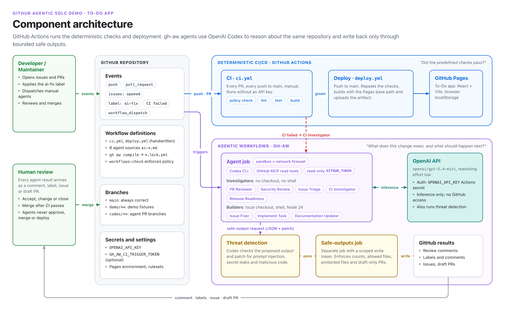
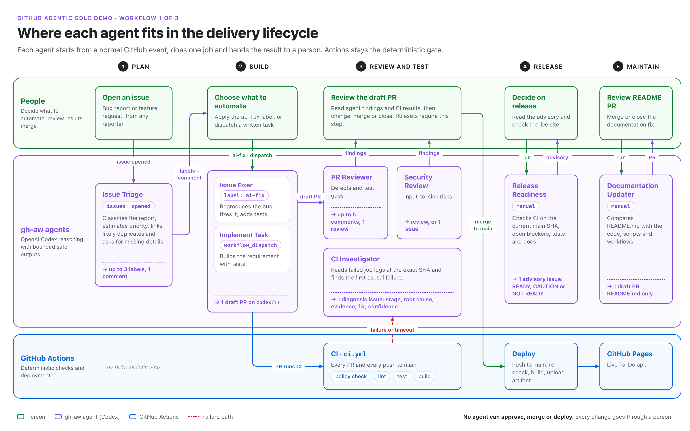
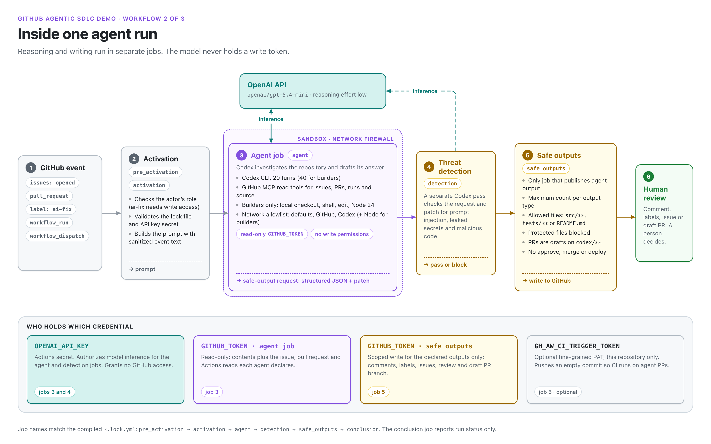
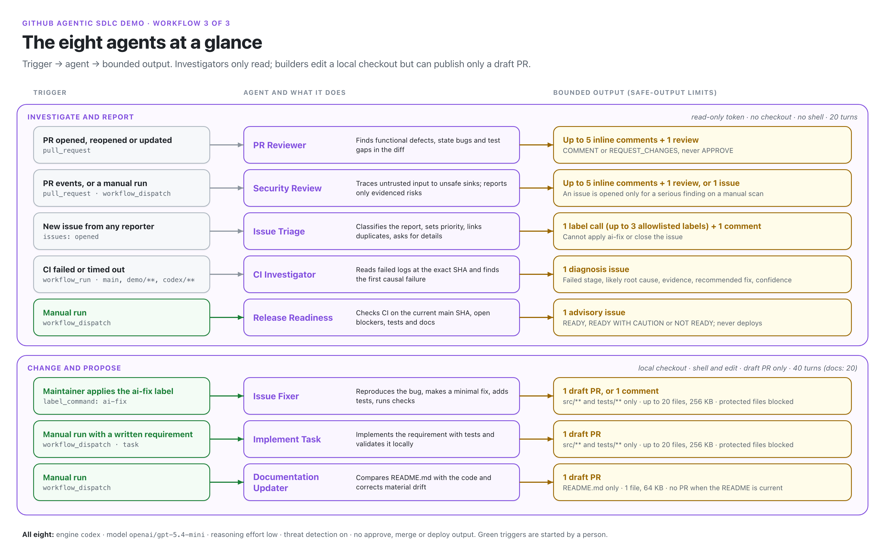

# Diagrams

Four PNG diagrams for explaining the demo. Each is 3200×2000 (16:10), so it works on a slide or in a document.

| File | Shows | Use it to explain |
|---|---|---|
| [01-architecture.png](diagrams/01-architecture.png) | Components | How the repository, GitHub Actions, the gh-aw agents and the OpenAI API fit together |
| [02-sdlc-flow.png](diagrams/02-sdlc-flow.png) | Workflow 1 of 3 | Where each agent fits from planning to maintenance |
| [03-agent-run.png](diagrams/03-agent-run.png) | Workflow 2 of 3 | What happens inside a single agent run, and who holds which credential |
| [04-agent-catalog.png](diagrams/04-agent-catalog.png) | Workflow 3 of 3 | Trigger, purpose and output limits for all eight agents |

## Component architecture



Two lanes share one repository. The blue lane is deterministic: CI runs the workflow
policy check, lint, tests and build, and Deploy publishes to GitHub Pages. The purple lane
is gh-aw: the agent job reasons with OpenAI Codex using a read-only token. Its proposed
output passes threat detection, and then a separate safe-outputs job writes it to GitHub.
Every result comes back to a person.

## Where each agent fits in the delivery lifecycle



Read it column by column. People decide and review (green), agents investigate or propose
(purple), and GitHub Actions gates every PR and deployment (blue). The dashed red arrow is
the failure path: a failed or timed-out CI run starts the CI Investigator.

## Inside one agent run



Steps 1 to 6 match the jobs in each compiled `*.lock.yml`. The key point is the split
between step 3, where Codex reasons with read access only, and step 5, where a separate job
holds the write token and enforces the safe-output limits. The bottom row shows that the
OpenAI key and the GitHub tokens are separate.

## The eight agents at a glance



Investigators read and report. Builders edit a local checkout, but the only thing they can
publish is one draft PR within the allowed files. Green triggers are started by a person.

## Editing the diagrams

The sources are HTML files in [`diagrams/src/`](diagrams/src/). They share `diagram.css`
for styling, and `diagram.js` draws the connectors from `data-wire` elements. After you
edit a source, render it again with headless Chrome:

```sh
scripts/render-diagrams.sh                   # all diagrams
scripts/render-diagrams.sh 03-agent-run      # one diagram
CHROME=/path/to/chrome scripts/render-diagrams.sh
```

The diagrams describe the configuration in [WORKFLOWS.md](WORKFLOWS.md) and
[SECURITY-MODEL.md](SECURITY-MODEL.md). If an agent's trigger, permissions or
safe-output limits change, update the matching diagram as well.
